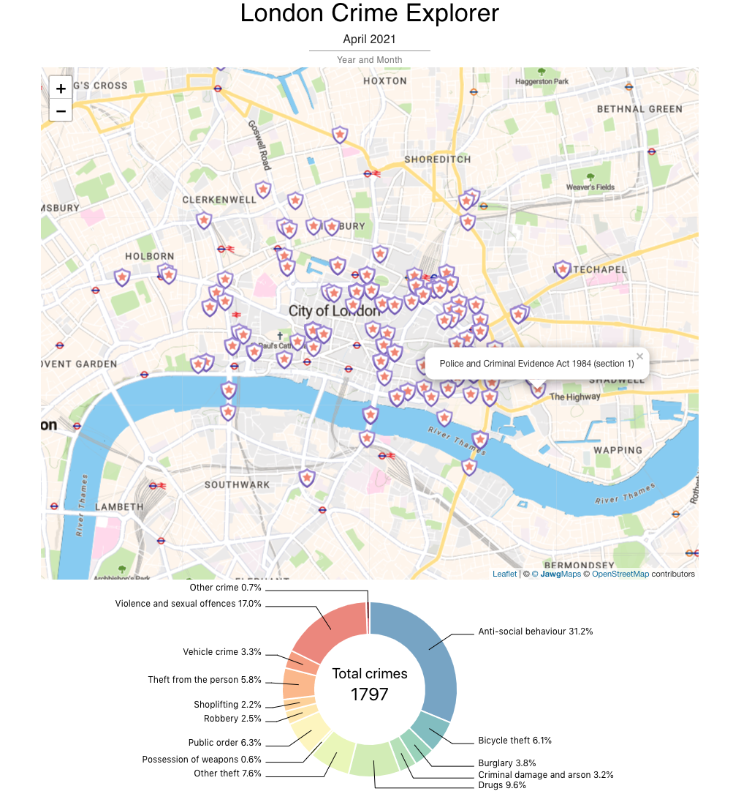

# London Police Crime Explorer

This application is designed to study crimes that have occurred in the City of London at specific date intervals. Each agglomeration of crime scenes can be clicked on the map and a pie chart will appear summarizing the types of crime.

## Preview
<center>
  
</center>

## Getting Started

```bash
git clone https://github.com/felistter/london-crime-explorer.git
cd london-crime-explorer
yarn install
npm start
```

## Known issues :bug:
- The map tooltip does not disappear when the date is changed.
- The guiding lines in the pie chart sometimes overlap in the bottom part of the chart.
- Tooltips are not styled and do not match the design concept.
- Dynamically change position in the Leaflet map is tricky and requires more thorough thinking through of application architecture.

## Possible improvements :hammer_and_wrench:
- Fetch all forces with corresponding dates and allow the user to choose date and force.
- When the user selects the force, the map automatically jumps to this place.
- Add a pie chart to find out how crime types connected to the outcome type. 

## License

Licensed under the MIT License.

